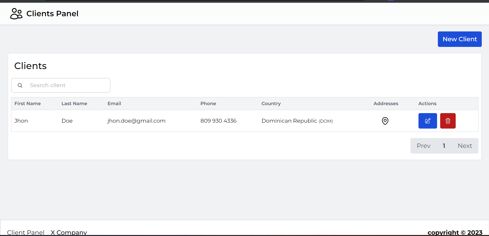
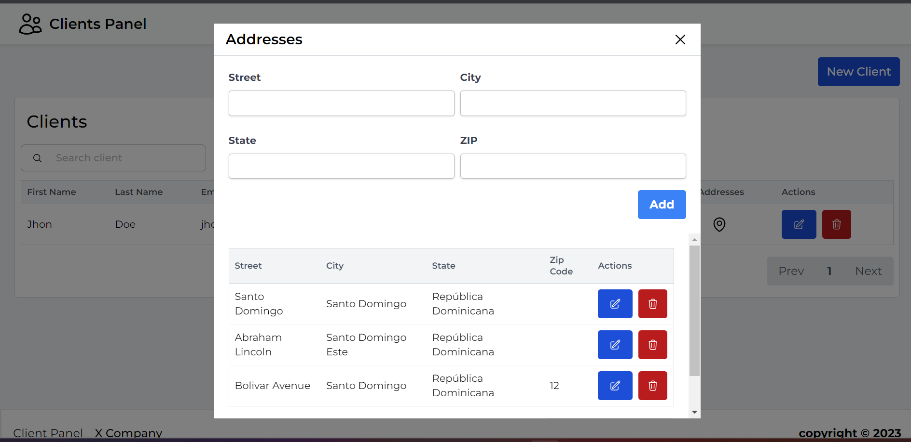

## Client List
This is a sample project created with Next.js that displays a list of clients. To run the project, follow these steps:

Clone the repository:
```bash
git clone https://github.com/samueldlacruz/oriontek-client-list.git
```
Install the dependencies:
```bash
cd client-list
npm install
```

Run the project:
```bash
npm run dev
Open your browser and go to the URL http://localhost:3000.
```
Screenshots
Here are two screenshots of the project:


---



Thank you for checking out this project!